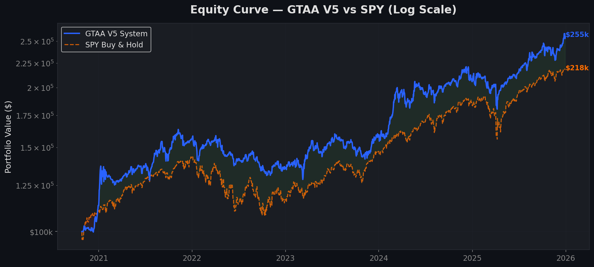
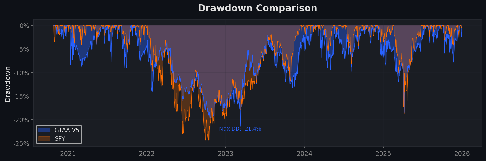
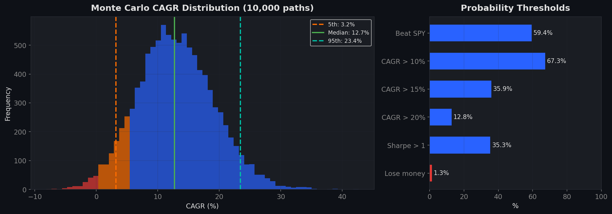
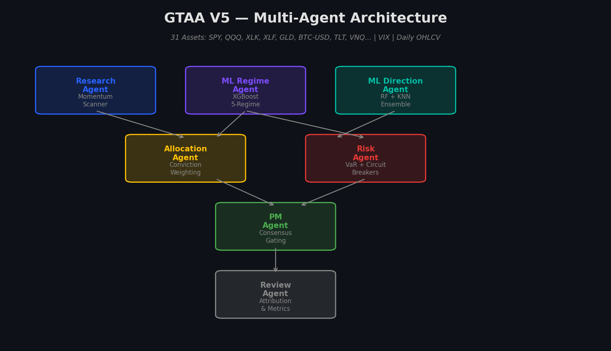
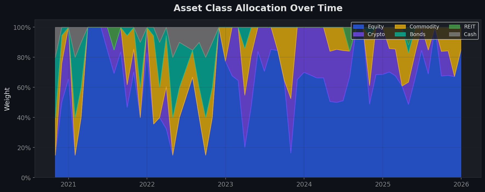
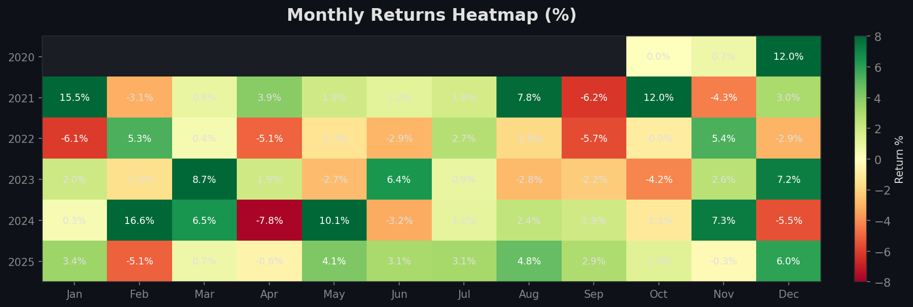
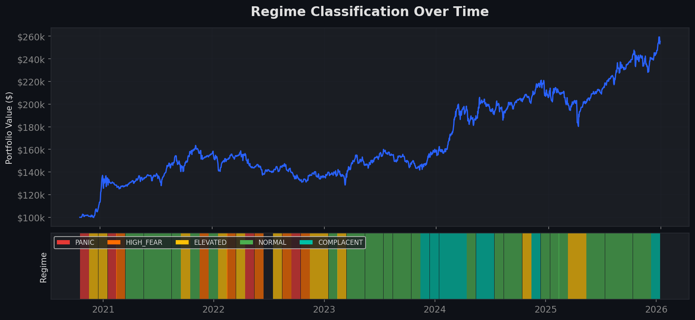
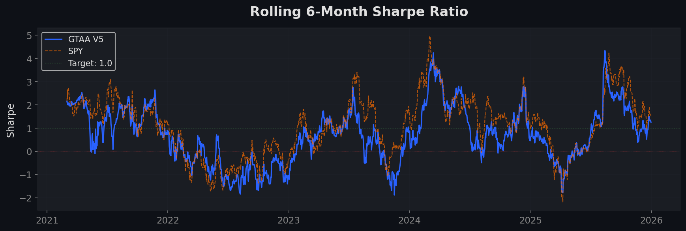

[](https://github.com/srn91/gtaa-multi-agent-system/actions/workflows/tests.yml)
[](LICENSE)
[](https://python.org)

# GTAA Multi-Agent System

A regime-aware, multi-asset momentum rotation engine where specialized agents handle research, regime detection, direction prediction, allocation, risk control, and post-trade review. Built as a research prototype exploring whether a modular agent-based architecture can produce better risk-adjusted returns than passive benchmarks.

> **[Interactive Walkthrough](notebooks/walkthrough.ipynb)** — Run the agent pipeline step-by-step on live data

---

## Why This Project Exists

Most trading repos stop at a single backtest or a single model. This project explores a more institutional workflow: a modular GTAA system where each component has a defined role, typed inputs/outputs, and auditable reasoning. The goal is not to claim alpha — it's to build a framework where signals, decisions, and risk controls are transparent and reproducible.

The system fuses ideas from six quantitative research projects covering regime-aware options trading, LSTM trend prediction, RF/KNN ensembles for metal futures, stochastic volatility modeling, portfolio optimization, and liquidity-driven signal design.

---

## Results (2020–2025, net of transaction costs)

| Metric | GTAA System | SPY Buy & Hold | Delta |
|---|---|---|---|
| CAGR | 20.9% | 16.3% | +4.6% |
| Sharpe Ratio | 0.92 | 0.81 | +0.11 |
| Sortino Ratio | 1.13 | 0.92 | +0.21 |
| Max Drawdown | -21.3% | -24.5% | +3.2% better |
| Calmar Ratio | 0.98 | 0.67 | +0.32 |
| Total Return | 168% | 119% | +49% |

These are backtest results from one historical period. See Monte Carlo and [Limitations](#limitations) for what these numbers mean in practice. Reproducibility instructions are [below](#reproducibility).





---

## Monte Carlo Validation — 10,000 Simulated Paths

The backtest above is one path. To understand the range of outcomes, we ran 10,000 block-bootstrapped simulations (21-day blocks to preserve momentum structure).

| Metric | Worst Case (5th pctl) | Expected (Median) | Best Case (95th pctl) |
|---|---|---|---|
| CAGR | 3.8% | 13.5% | 24.6% |
| Sharpe Ratio | 0.32 | 0.89 | 1.48 |
| Max Drawdown | -33.4% | -20.9% | -10.9% |
| Final Value ($100k) | $132k | $258k | $521k |

**Key probabilities:** 63% chance of beating SPY. 1% chance of losing money. Only 16% of paths exceeded 20% CAGR — the 20.9% backtest landed in roughly the 80th percentile of possible outcomes. **The median expectation is 13.5%, not 20.9%.**



---

## Architecture — 8 Agents

Each agent produces a typed `Signal` object containing structured data, a confidence score (0.0–1.0), and human-readable reasoning. The PM Agent only executes when there is sufficient consensus.

> **[Full architecture deep-dive →](docs/architecture.md)**



| Agent | Role | Model | Output |
|---|---|---|---|
| Research | Momentum scanner | — | Ranked assets with trend flags |
| ML Regime | Market state classifier | XGBoost | 5-regime label + per-regime probabilities |
| ML Direction | Per-asset direction | RF + KNN | Direction + confidence per ticker |
| Allocation | Portfolio construction | — | Target weights (momentum + ML + regime) |
| Risk | Limit enforcement | — | Approved weights (can veto) |
| PM | Final decision | — | Execute or hold with conviction score |
| Review | Attribution | — | Performance metrics + anomaly flags |
| Rule Regime | Fallback classifier | — | 3-regime label (when ML unavailable) |

### Decision flow

```
Research Agent → ML Regime Agent → ML Direction Agent
       ↓                ↓                  ↓
              Allocation Agent (blend all signals)
                        ↓
                   Risk Agent (enforce limits, can veto)
                        ↓
                    PM Agent (consensus gate → execute or hold)
                        ↓
                  Review Agent (log outcome, compute attribution)
```

---

## Proof: Real Agent Decision Traces

These are actual outputs from the system running on real market data — not mock examples. Each trace shows every agent's input, output, confidence, and reasoning for one rebalance decision.

### [NORMAL regime — typical bull market rebalance →](reports/sample_decisions/normal_regime_walkthrough.md)

Shows the full 7-step pipeline during standard conditions: sector rotation into XLK/QQQ, 92% risk asset deployment, RF+KNN agreement on tech, Risk Agent approving without modification.

### [PANIC regime — automatic defensive rotation →](reports/sample_decisions/panic_regime_walkthrough.md)

Shows the system automatically switching to bonds + gold + defensive equities when XGBoost detects panic with 83% confidence. Momentum selection is bypassed entirely. 30% equity retained for recovery capture.

### Raw JSON artifacts

- [`decision_example.json`](reports/sample_decisions/decision_example.json) — Machine-readable signal dump
- [`normal_regime.json`](reports/sample_decisions/normal_regime.json) — Full structured output
- [`panic_regime.json`](reports/sample_decisions/panic_regime.json) — Defensive regime trace
- [`complacent_regime.json`](reports/sample_decisions/complacent_regime.json) — Max-aggression regime trace

---

## Current Status

| Component | Status |
|---|---|
| Backtesting engine | ✅ Implemented and validated |
| 8-agent architecture with typed signals | ✅ Implemented (12/12 tests passing) |
| XGBoost 5-regime classifier (LAG-1) | ✅ Implemented |
| RF + KNN direction ensemble | ✅ Implemented with ATR and SMA filters |
| Monte Carlo simulation (10K paths) | ✅ Implemented |
| Transaction cost model | ✅ Implemented (5bps ETF, 15bps crypto) |
| Report generation (9 charts) | ✅ Implemented |
| Strategy config (YAML) | ✅ Implemented ([gtaa_v5.yaml](config/strategies/gtaa_v5.yaml)) |
| Streamlit dashboard | ✅ Implemented |
| Alpaca paper trading | ✅ Built (not yet live-tested) |
| CI pipeline | ✅ GitHub Actions (Python 3.11–3.13) |
| Walk-forward retraining | 🔲 Planned |
| Live paper-trade monitoring | 🔲 Planned |
| Persistent agent memory | 🔲 Planned |

---

## Asset Universe — 31 Instruments

| Class | Tickers |
|---|---|
| US Equity (broad) | SPY, QQQ, IWM, MDY |
| US Equity (sectors) | XLK, XLF, XLE, XLV, XLY, XLP, XLI, XLU |
| International | EFA, EEM, VGK, EWJ |
| Fixed Income | TLT, IEF, SHY, HYG, LQD, TIP |
| Commodities | GLD, SLV, USO, DBC |
| Real Estate | VNQ, VNQI |
| Crypto | BTC-USD, ETH-USD |
| Cash | BIL |



---

## Monthly Returns



## Regime Classification



## Rolling Risk Metrics



---

## Reproducibility

To reproduce the exact metrics shown above:

```bash
pip install -r requirements.txt        # Install dependencies
python3 run_backtest.py                 # Run V5 production backtest
python3 -m engine.monte_carlo           # 10,000 Monte Carlo simulations
python3 reports/generate_reports.py     # Generate all charts
python3 tests/test_agents.py            # 12-test suite (all agents)
python3 -m streamlit run dashboard/app.py  # Interactive dashboard
```

**Strategy config:** [`config/strategies/gtaa_v5.yaml`](config/strategies/gtaa_v5.yaml) documents every parameter.

**Date range:** 2020-01-01 to 2025-12-31, monthly rebalancing, 5bps ETF slippage, 15bps crypto slippage, zero commissions. ML regime retrains annually.

---

## Limitations

- **Results are from one historical period.** 2020–2025 includes a strong equity bull market and crypto super-cycle. The Monte Carlo median CAGR of 13.5% is a more realistic forward expectation than the 20.9% backtest peak.
- **No live paper-trading results yet.** The Alpaca integration is built but not validated in real-time execution.
- **Crypto exposure averages 14.5%.** The ML correctly identified crypto as the strongest momentum play during this period, but that edge may not persist.
- **Agent communication is sequential, not adversarial.** Agents pass typed Signals in a pipeline — there is no inter-agent negotiation, persistent memory, or disagreement resolution beyond the PM consensus gate.
- **Transaction cost model is simplified.** Market impact, partial fills, and timing slippage are not fully captured.

---

## Version History

The system evolved from 7.4% to 20.9% CAGR across 5 iterations. See [CHANGELOG.md](CHANGELOG.md).

| Version | CAGR | Sharpe | Max DD | Key Fix |
|---|---|---|---|---|
| V1 | 7.4% | 0.75 | -14% | Initial — vol-adjusted momentum overweighted bonds |
| V3 | 10.1% | 0.64 | -21% | Raw momentum during bullish regimes |
| V4 | 17.8% | 0.68 | -27% | XGBoost regime + RF/KNN direction |
| **V5** | **20.9%** | **0.92** | **-21%** | **Fixed cash drag, ART vol targeting, allocation floors** |
| V6 | 20.0% | 0.62 | -46% | Over-concentrated — rejected |

Archived versions in [`research/archive/`](research/archive/).

---

## Research Lineage

| Source | What Was Adapted |
|---|---|
| Regime-Aware Options Engine (Penubothu, Theegela, Girkar) | XGBoost 5-regime, LAG-1 protocol, VaR sizing |
| LSTM S&P 500 Prediction (Li, Lin, Yang) | Bull ratio, ATR filter, SMA20 filter, vol targeting |
| ML Metal Futures Strategies (Shah) | RF + KNN ensemble, agreement-based conviction |
| Quantitative Options Framework (Gu & Prashad) | Walk-forward validation, ART risk targeting |
| ATPM Portfolio Engine (Dipen & Mukta) | MVO blending, multi-layer architecture |
| Liquidity-Driven Trading (Gong, Kang, Tong) | Signal construction methodology |

---

## Project Structure

```
├── run_backtest.py              # Canonical entry point (V5 engine)
├── README.md
├── CHANGELOG.md
├── CONTRIBUTING.md
├── LICENSE                      # Apache 2.0
├── requirements.txt
│
├── agents/                      # 8 agent implementations
│   ├── base_agent.py            #   Signal protocol + BaseAgent ABC
│   ├── research_agent.py        #   Momentum scanner
│   ├── ml_regime_agent.py       #   XGBoost 5-regime classifier
│   ├── ml_direction_agent.py    #   RF + KNN ensemble
│   ├── regime_agent.py          #   Rule-based fallback
│   ├── risk_agent.py            #   Limits, VaR, circuit breakers
│   ├── allocation_agent.py      #   Portfolio construction
│   ├── pm_agent.py              #   Consensus gating
│   └── review_agent.py          #   Post-trade attribution
│
├── config/
│   ├── settings.py              # Asset universe + parameters
│   ├── production.py            # Tuned production config
│   └── strategies/
│       └── gtaa_v5.yaml         # Strategy config (all parameters documented)
│
├── data/                        # Data loading + caching
├── engine/                      # Backtester + Monte Carlo (10K paths)
├── trading/                     # Alpaca paper trading + live signals
├── dashboard/                   # Streamlit interactive dashboard
├── docs/
│   └── architecture.md          # Deep architecture documentation
├── notebooks/
│   └── walkthrough.ipynb        # Interactive agent demo
├── reports/
│   ├── *.png                    # 9 publication-quality charts
│   ├── generate_reports.py      # Chart generator
│   └── sample_decisions/        # Real agent decision traces (JSON + markdown)
├── tests/                       # 12-test suite (all agents + ML models)
├── research/archive/            # Historical versions (V1–V6)
│
└── .github/
    ├── workflows/tests.yml      # CI: tests on Python 3.11–3.13
    ├── workflows/paper_trade.yml # Weekly automated signal generation
    └── ISSUE_TEMPLATE/          # Bug report + feature request templates
```

---

## License

Copyright 2026 Sathwik Rao Nadipelli — [Apache License 2.0](LICENSE)

This repository contains a research and infrastructure framework only. All proprietary trading strategies, alpha generation logic, and production-level execution systems are intentionally excluded. The authors make no claims regarding financial performance, and any results shown are for research and educational purposes only.
